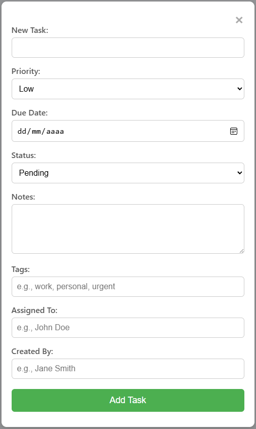
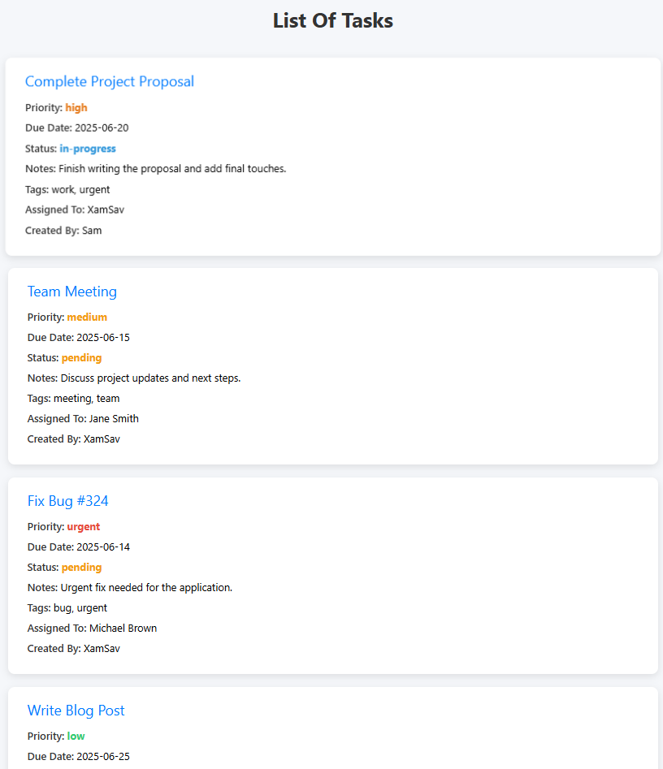

# 📝 To Do List by XamSav


Un proyecto de lista de tareas desarrollado en Java usando Servlets y JSP con interfaz profesional. Perfecto como ejemplo educativo o como base para sistemas de gestión de tareas.

---

## 📚 Tabla de Contenidos

- [🎯 Funcionalidades](#-funcionalidades)
- [⚙️ Tecnologías utilizadas](#-tecnologías-utilizadas)
- [📸 Capturas de pantalla](#-capturas-de-pantalla)
- [🚀 Cómo ejecutar](#-cómo-ejecutar)
- [🛣 Roadmap futuro](#-roadmap-futuro)
- [🧑 Autor](#-autor)

---

## 🎯 Funcionalidades

- ✅ Creación de tareas con los siguientes campos:
  - Nombre
  - Prioridad (`Low`, `Medium`, `High`, `Urgent`)
  - Fecha de vencimiento
  - Estado (`Pending`, `In Progress`, `Completed`, `Cancelled`)
  - Notas
  - Etiquetas (tags)
  - Asignado a
  - Creado por
- ✅ Visualización de tareas en tarjetas con diseño moderno.
- ✅ Interfaz mejorada con HTML, CSS3 y JavaScript.
- ✅ Gestión de tareas almacenadas en sesión (prototipo).

---

## ⚙️ Tecnologías utilizadas

- **Backend:** Java (JSP + Servlets)
- **Frontend:** HTML5, CSS3, JavaScript
- **Servidor de Aplicaciones:** Apache Tomcat
- **IDE recomendado:** NetBeans

---

## 📸 Capturas de pantalla

### Formulario de creación:



### Listado de tareas:



---

## 🚀 Cómo ejecutar

### 1️⃣ Clonar el repositorio

```bash
git clone https://github.com/XamSav/ToDoList-JavaWeb.git
```

### 2️⃣ Importar el proyecto

- Abre tu IDE favorito (NetBeans, IntelliJ IDEA o Eclipse).
- Selecciona la opción de **importar proyecto existente** o **Dynamic Web Project**.
- Selecciona la carpeta del proyecto local.

### 3️⃣ Configurar el servidor de aplicaciones

- Asegúrate de tener instalado **Apache Tomcat** (se recomienda Tomcat 9 o superior).
- En tu IDE, configura Tomcat como servidor de ejecución.
- Agrega el proyecto al servidor y despliega la aplicación.

### 4️⃣ Ejecutar la aplicación

- Inicia el servidor desde tu IDE.
- Accede en tu navegador web a: http://localhost:8080/ToDoList

## 🛣 Roadmap futuro

- [ ] Persistencia de datos (JPA + MySQL/PostgreSQL)
- [ ] CRUD completo (editar y eliminar tareas)
- [ ] Autenticación de usuarios
- [ ] Buscador y filtros de tareas
- [ ] Tema oscuro y diseño completamente responsive
- [ ] API REST para integración externa
- [ ] Soporte multiusuario
- [ ] Tests automatizados
- [ ] Despliegue en la nube (Heroku, Render, Vercel, etc.)

---

## 🧑 Autor

- **XamSav**
- GitHub: [@XamSav](https://github.com/XamSav)

---


